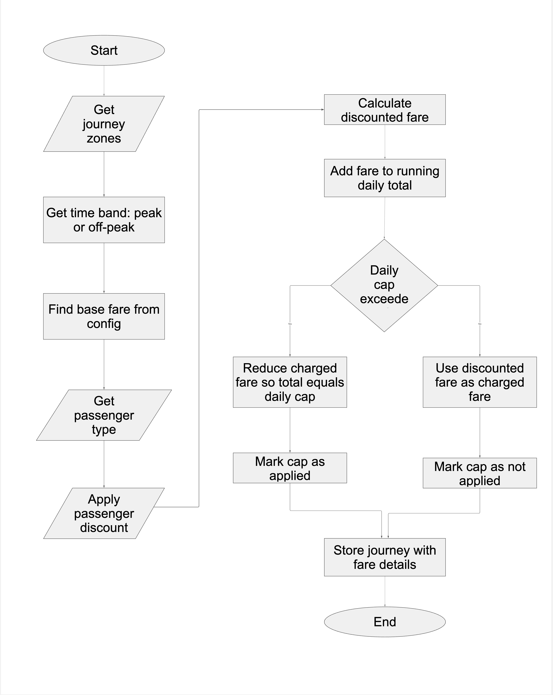
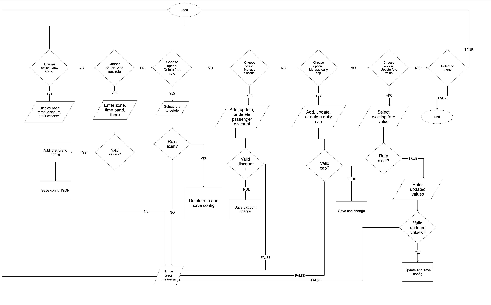
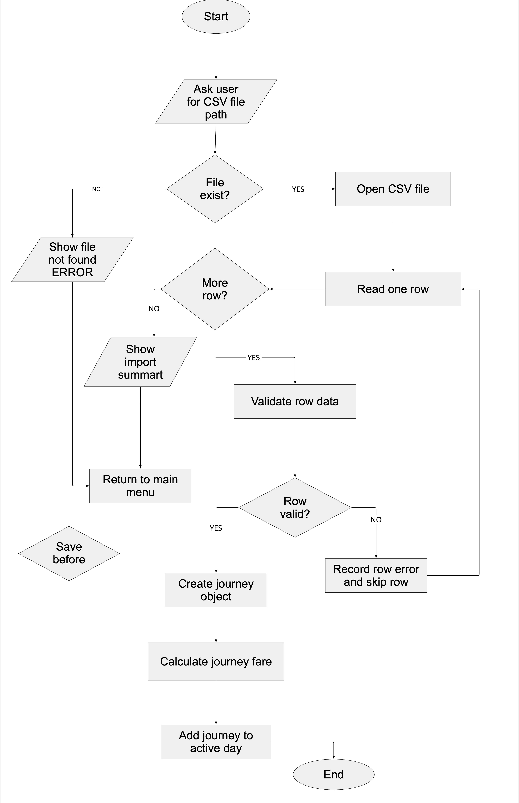
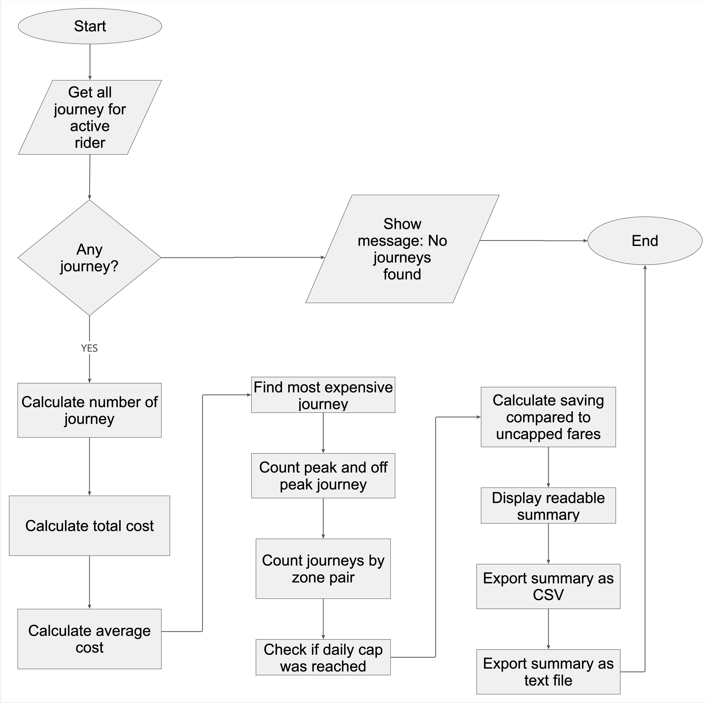
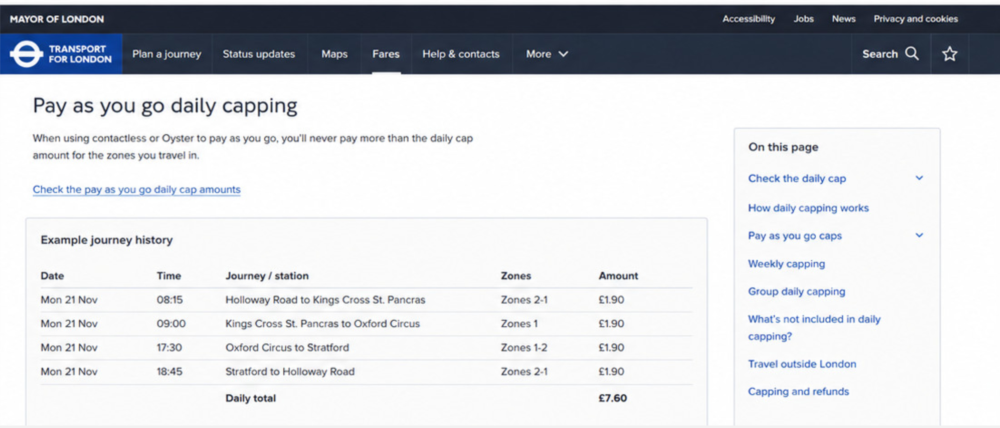
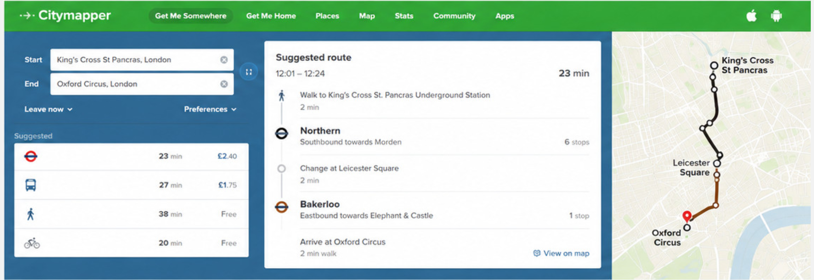

# IY4113 Milestone 1 Part 2

| Assessment Details | Please Complete All Details                                             |
| ------------------ | ----------------------------------------------------------------------- |
| Group              | B                                                                       |
| Module Title       | IY4113 Applied Software Engineering using Object-Orientated Programming |
| Assessment Type    | ASSESSMENT 2: Java Programming with Inheritance and File Handling       |
| Module Tutor Name  | Jonathan shore                                                          |
| Student ID Number  | P505853                                                                 |
| Date of Submission | 14 June 2026                                                            |
| Word Count         |                                                                         |
| GitHub Link        | https://github.com/T0505853Maeko/4113_Milestone_1_Part_2                |

- [ ] *I confirm that this assignment is my own work. Where I have referred to academic sources, I have provided in-text citations and included the sources in
  the final reference list.*

- [ ] *Where I have used AI, I have cited and referenced appropriately.

------------------------------------------------------------------------------------------------------------------------------

### Purpose of the Program

------------------------------------------------------------------------------------------------------------------------------

designed to help riders track the cost of daily travel. A rider can enter each journey manually or import journeys from a CSV file. The system calculates the fare using the number of zones crossed and whether the journey is peak or off-peak. The system then applies passenger discounts and daily caps so that the user can see accurate running totals and savings. The administrator section makes the system more flexible because fares, discounts, caps and peak windows can be updated without rewriting the whole program. This is similar to real transport systems where fare rules can change over time.

------------------------------------------------------------------------------------------------------------------------------

### Flowcharts

------------------------------------------------------------------------------------------------------------------------------

Main Flowchart

Menu Flowchart

Fare calculator Flowchart

Admin Flowchart

Import CSV Flowchart

Report Flowchart

------------------------------------------------------------------------------------------------------------------------------

### Input Process Output Table

------------------------------------------------------------------------------------------------------------------------------

IPO Tables

### Launch and Load Configuration

| Input                               | Process                                                                                                                   | Output                                                                                  |
| ----------------------------------- | ------------------------------------------------------------------------------------------------------------------------- | --------------------------------------------------------------------------------------- |
| config.json file, or no config file | Check whether config exists. If it exists, read JSON and validate values. If missing or invalid, use safe default values. | Active fare configuration loaded into memory. Error message shown if defaults are used. |

### Create Rider Profile

| Input                                              | Process                                                                                                                     | Output                                           |
| -------------------------------------------------- | --------------------------------------------------------------------------------------------------------------------------- | ------------------------------------------------ |
| Rider name, passenger type, default payment option | Validate name is not empty. Validate passenger type and payment option are from allowed values. Create RiderProfile object. | Active rider profile displayed and ready to use. |

### Save/Load Rider Profile

| Input                                 | Process                                                                                                                     | Output                                                                  |
| ------------------------------------- | --------------------------------------------------------------------------------------------------------------------------- | ----------------------------------------------------------------------- |
| JSON file path and rider profile data | For save: convert profile object to JSON and write to file. For load: read JSON, validate fields and create profile object. | Profile saved or loaded successfully, or clear error message displayed. |

### Add Journey

| Input                                                      | Process                                                                                                                                                                                        | Output                                                 |
| ---------------------------------------------------------- | ---------------------------------------------------------------------------------------------------------------------------------------------------------------------------------------------- | ------------------------------------------------------ |
| Date/time, from zone, to zone, active rider passenger type | Validate date/time format and zone range. Generate unique journey ID. Calculate zones crossed. Determine peak/off-peak. Calculate base fare, discount and charged fare. Recalculate daily cap. | Journey added to active day and running total updated. |

### Edit Journey

| Input                                                 | Process                                                                                                 | Output                                            |
| ----------------------------------------------------- | ------------------------------------------------------------------------------------------------------- | ------------------------------------------------- |
| Journey ID, new date/time, new from zone, new to zone | Check journey ID exists. Validate new values. Update journey object. Recalculate fare and daily totals. | Updated journey list and corrected running total. |

### Delete Journey

| Input      | Process                                                                                        | Output                                            |
| ---------- | ---------------------------------------------------------------------------------------------- | ------------------------------------------------- |
| Journey ID | Check ID exists. Remove journey if valid. Recalculate remaining journey totals and daily caps. | Journey removed, or error message for invalid ID. |

### Import Journeys from CSV

| Input                                    | Process                                                                                                                                          | Output                                                                 |
| ---------------------------------------- | ------------------------------------------------------------------------------------------------------------------------------------------------ | ---------------------------------------------------------------------- |
| CSV file path containing journey records | Open file. Read each row. Validate required columns. Add valid journeys to active day. Reject invalid rows with explanation. Recalculate totals. | Imported journeys shown in journey list. Import success/error message. |

### Export Journeys to CSV

| Input                                        | Process                                                                                                                                                     | Output                    |
| -------------------------------------------- | ----------------------------------------------------------------------------------------------------------------------------------------------------------- | ------------------------- |
| Active journey list and destination CSV path | Write header row. Write each journey with ID, date/time, zones, time band, passenger type, base fare, discount, uncapped fare, charged fare and cap status. | CSV journey file created. |

### Fare Calculation

| Input                                                      | Process                                                                                                         | Output                                   |
| ---------------------------------------------------------- | --------------------------------------------------------------------------------------------------------------- | ---------------------------------------- |
| Zones crossed, journey time, passenger type, active config | Determine time band using peak windows. Find base fare. Apply discount. Apply daily cap based on running total. | Final charged fare and cap applied flag. |

### End-of-Day Summary

| Input                                 | Process                                                                                                                   | Output                                                 |
| ------------------------------------- | ------------------------------------------------------------------------------------------------------------------------- | ------------------------------------------------------ |
| Active journey list and rider profile | Count journeys. Calculate total, average, most expensive journey, cap savings, peak/off-peak counts and zone pair counts. | Summary displayed and exported as CSV and text report. |

### Admin Login

| Input          | Process                                                | Output                                                |
| -------------- | ------------------------------------------------------ | ----------------------------------------------------- |
| Admin password | Compare input password with configured admin password. | Admin menu shown if correct, otherwise access denied. |

### Admin Manage Configuration

| Input                                      | Process                                                                                                              | Output                                                                 |
| ------------------------------------------ | -------------------------------------------------------------------------------------------------------------------- | ---------------------------------------------------------------------- |
| Fare, discount, cap or peak window changes | Validate values. Add, update or delete selected config item. Save valid config to JSON. Do not save invalid changes. | Updated configuration or error message explaining validation failure.* |

------------------------------------------------------------------------------------------------------------------------------

### Algorithm Design

---

- *Add **images** for the design of your algorithm. Choose either Flowchart or JSP diagrams to demonstrate the functional elements of the algorithm. There should be multiple images for this part as you are decomposing the problem into smaller elements.*

- *Include a class diagram to demonstrate the class structure of the proposed program design.

------------------------------------------------------------------------------------------------------------------------------

### Research (minimum of 1 required, preferrebly 2)

---

*Research existing programs that solve a similar problem. The program does not have to be written in java or object orientated in nature - just solve a similar type of problem.*

*Use the strucutre below to capture your evidence:*

------------------------------------------------------------------------------------------------------------------------------Name of program:

Reference (link):
https://tfl.gov.uk/fares/find-fares/capping
https://tfl.gov.uk/fares/ways-to-pay/pay-as-you-go

What it does well (2-3 features that work effectively):

TfL's Oyster and Contactless systems work well because they automatically calculate the correct fare when passengers travel. Users do not need to manually calculate the price for each trip because the system checks the trip information and applies the correct fare.

Another useful feature is daily rate limiting. This means passengers can make multiple trips in a day, but once their total trips reach the daily limit, they will not be charged more than that amount. This is useful for CityRide Lite because my program also needs to calculate daily totals and apply daily limits.

The system also supports various payment methods, including Oyster cards and contactless payment cards. This is similar to passenger profiles in CityRide Lite, where users can save default payment options.

What it does poorly (at least 1 feature):

One drawback is that the tariff rules can be difficult for new users to understand. The system includes different zones, peak and off-peak times, daily and weekly limits. This can be confusing for users who want to understand exactly how their final tariff is calculated.

Key design ideas you could reuse (e.g., layout, navigation, input/output, program structure):

I can reuse the automatic fare capping idea in my CityRide Lite program. After each trip is added, the program should calculate the cumulative total and check whether the daily limit has been reached. I can also reuse the idea to display clear fare information to passengers, including the base fare, any discounts applied, the applicable fare, and whether any fare caps have been applied.

Screenshot (showing the interface/output):

------------------------------------------------------------------------------------------------------------------------------

Reference (link):
https://citymapper.com/

What it does well (2-3 features that work effectively):

Citymapper works well because it provides users with clear travel options for public transportation, walking, cycling, and other transportation methods. The app allows users to compare different routes, making trip planning easier.

Another useful feature is that Citymapper presents trip information in a simple and user-friendly way. Users enter a starting point and destination, and the app then displays possible trips. This is useful for CityRide Lite because my app also requires clear menus and instructions so users understand what information to enter.

Citymapper also provides real-time trip information and step-by-step directions. While my CityRide Lite app doesn't require real-time tracking, the idea of ​​displaying clear trip details can be reused when displaying trip logs and daily summaries.

What it does poorly (at least 1 feature):

One drawback is that Citymapper relies heavily on an internet connection and live transportation data. If live data is missing or inaccurate, route information may not be entirely reliable. For my college project, I was able to avoid this issue by using local travel data, JSON files, and CSV files, instead of relying on live online data.

Key design ideas you could reuse (e.g., layout, navigation, input/output, program structure):

I can reuse the idea of simple input and clear output. Citymapper requests trip information from users and then presents the results in an organized manner. In CityRide Lite, I can use a menu-based structure where riders can add trips, view totals, export reports, and save their profiles.

Screenshot (showing the interface/output):

------------------------------------------------------------------------------------------------------------------------------

### Gantt Chart

------------------------------------------------------------------------------------------------------------------------------

------------------------------------------------------------------------------------------------------------------------------

### Diary Entries

------------------------------------------------------------------------------------------------------------------------------

#### 8 June 2026

Today I reviewed the assignment brief and Milestone 1 template. I identified the purpose of the CityRide Lite Part 2 program, the core functionality, and the system constraints. I also created the Input/Process/Output table for the main program functions. This helped me understand what data the program needs, how it should process the data, and what outputs should be produced.

#### 9 June 2026

Today I created the Main Flowchart, Menu Flowchart, and Fare Calculator Flowchart. These flowcharts helped me design the main structure of the program and the order of the fare calculation process. I made sure the fare calculator included zones, peak/off-peak travel, passenger discounts, and daily caps.

#### 10 June 2026

Today I created the Admin Flowchart, ImportCSV Flowchart, and Report Flowchart. I also added research evidence and references for similar transport programs. I used TfL as research for fare capping and Citymapper as research for journey planning. This helped me understand how real transport systems manage journeys, fares, and user-friendly travel information.

#### 11 June 2026

Today I created the class diagram and improved the object-oriented design section. I planned the main classes, including Rider, Admin, Journey, FareConfig, FareCalculator, JourneyManager, CsvService, and ReportService. This helped me organise the program into smaller parts with clear responsibilities.

#### 12 June 2026

Today I updated the Gantt chart and checked that the project plan matched the work I had completed. I made sure the timeline showed the IPO table, flowcharts, research, references, class diagram, and final review tasks clearly.

#### 13 June 2026

Today I wrote and improved the diary/blog section. I checked that each diary entry explained what I did, why I did it, and any problems I faced. I also reviewed the Milestone 1 document to make sure the writing was clear and suitable for submission.

#### 14 June 2026

Today I completed the final review of Milestone 1. I checked the formatting, spelling, image links, flowcharts, Gantt chart, references, and overall document structure. I also prepared the final version for GitHub upload and PDF export.

------------------------------------------------------------------------------------------------------------------------------
