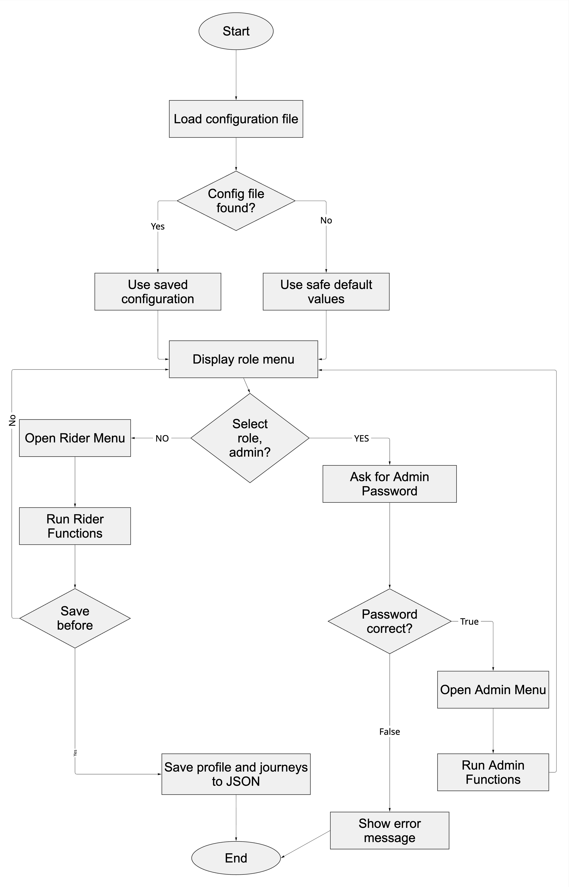
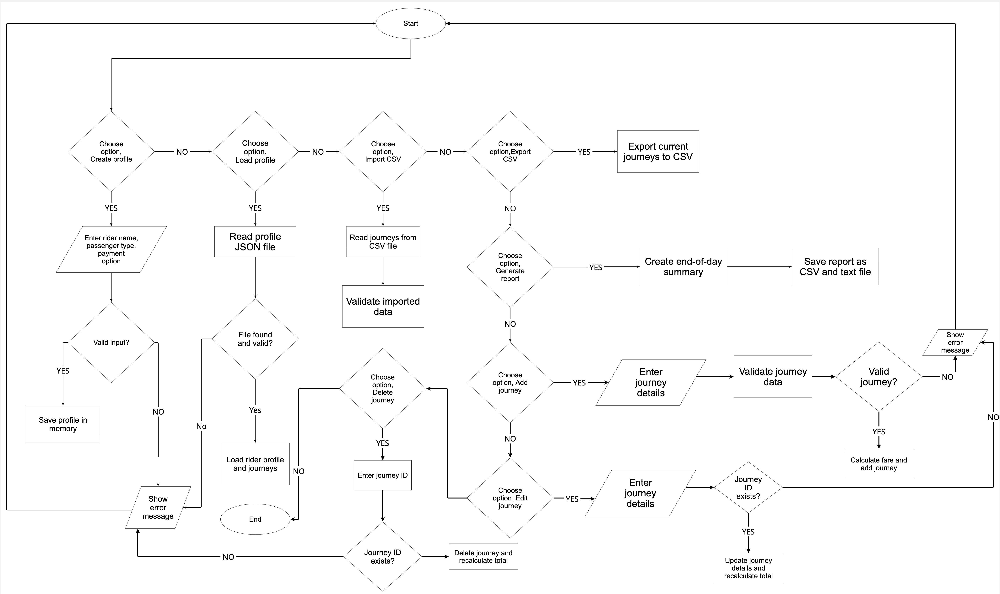
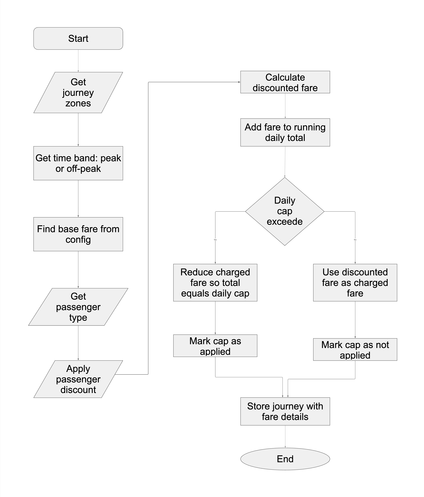

# IY4113 Milestone 1 Part 2

| Assessment Details | Please Complete All Details                                             |
| ------------------ | ----------------------------------------------------------------------- |
| Group              | B                                                                       |
| Module Title       | IY4113 Applied Software Engineering using Object-Orientated Programming |
| Assessment Type    | ASSESSMENT 2: Java Programming with Inheritance and File Handling       |
| Module Tutor Name  | Jonathan shore                                                          |
| Student ID Number  | P505853                                                                 |
| Date of Submission | 14 June 2026                                                            |
| Word Count         |                                                                         |
| GitHub Link        | https://github.com/T0505853Maeko/4113_Milestone_1_Part_2                |

- [ ] *I confirm that this assignment is my own work. Where I have referred to academic sources, I have provided in-text citations and included the sources in
  the final reference list.*

- [ ] *Where I have used AI, I have cited and referenced appropriately.

------------------------------------------------------------------------------------------------------------------------------

### Purpose of the Program

------------------------------------------------------------------------------------------------------------------------------

designed to help riders track the cost of daily travel. A rider can enter each journey manually or import journeys from a CSV file. The system calculates the fare using the number of zones crossed and whether the journey is peak or off-peak. The system then applies passenger discounts and daily caps so that the user can see accurate running totals and savings. The administrator section makes the system more flexible because fares, discounts, caps and peak windows can be updated without rewriting the whole program. This is similar to real transport systems where fare rules can change over time.

------------------------------------------------------------------------------------------------------------------------------

### Flowcharts

------------------------------------------------------------------------------------------------------------------------------

Main Flowchart

Menu Flowchart

Fare calculator Flowchart

------------------------------------------------------------------------------------------------------------------------------

### Input Process Output Table

------------------------------------------------------------------------------------------------------------------------------

IPO Tables

### Launch and Load Configuration

| Input                               | Process                                                                                                                   | Output                                                                                  |
| ----------------------------------- | ------------------------------------------------------------------------------------------------------------------------- | --------------------------------------------------------------------------------------- |
| config.json file, or no config file | Check whether config exists. If it exists, read JSON and validate values. If missing or invalid, use safe default values. | Active fare configuration loaded into memory. Error message shown if defaults are used. |

### Create Rider Profile

| Input                                              | Process                                                                                                                     | Output                                           |
| -------------------------------------------------- | --------------------------------------------------------------------------------------------------------------------------- | ------------------------------------------------ |
| Rider name, passenger type, default payment option | Validate name is not empty. Validate passenger type and payment option are from allowed values. Create RiderProfile object. | Active rider profile displayed and ready to use. |

### Save/Load Rider Profile

| Input                                 | Process                                                                                                                     | Output                                                                  |
| ------------------------------------- | --------------------------------------------------------------------------------------------------------------------------- | ----------------------------------------------------------------------- |
| JSON file path and rider profile data | For save: convert profile object to JSON and write to file. For load: read JSON, validate fields and create profile object. | Profile saved or loaded successfully, or clear error message displayed. |

### Add Journey

| Input                                                      | Process                                                                                                                                                                                        | Output                                                 |
| ---------------------------------------------------------- | ---------------------------------------------------------------------------------------------------------------------------------------------------------------------------------------------- | ------------------------------------------------------ |
| Date/time, from zone, to zone, active rider passenger type | Validate date/time format and zone range. Generate unique journey ID. Calculate zones crossed. Determine peak/off-peak. Calculate base fare, discount and charged fare. Recalculate daily cap. | Journey added to active day and running total updated. |

### Edit Journey

| Input                                                 | Process                                                                                                 | Output                                            |
| ----------------------------------------------------- | ------------------------------------------------------------------------------------------------------- | ------------------------------------------------- |
| Journey ID, new date/time, new from zone, new to zone | Check journey ID exists. Validate new values. Update journey object. Recalculate fare and daily totals. | Updated journey list and corrected running total. |

### Delete Journey

| Input      | Process                                                                                        | Output                                            |
| ---------- | ---------------------------------------------------------------------------------------------- | ------------------------------------------------- |
| Journey ID | Check ID exists. Remove journey if valid. Recalculate remaining journey totals and daily caps. | Journey removed, or error message for invalid ID. |

### Import Journeys from CSV

| Input                                    | Process                                                                                                                                          | Output                                                                 |
| ---------------------------------------- | ------------------------------------------------------------------------------------------------------------------------------------------------ | ---------------------------------------------------------------------- |
| CSV file path containing journey records | Open file. Read each row. Validate required columns. Add valid journeys to active day. Reject invalid rows with explanation. Recalculate totals. | Imported journeys shown in journey list. Import success/error message. |

### Export Journeys to CSV

| Input                                        | Process                                                                                                                                                     | Output                    |
| -------------------------------------------- | ----------------------------------------------------------------------------------------------------------------------------------------------------------- | ------------------------- |
| Active journey list and destination CSV path | Write header row. Write each journey with ID, date/time, zones, time band, passenger type, base fare, discount, uncapped fare, charged fare and cap status. | CSV journey file created. |

### Fare Calculation

| Input                                                      | Process                                                                                                         | Output                                   |
| ---------------------------------------------------------- | --------------------------------------------------------------------------------------------------------------- | ---------------------------------------- |
| Zones crossed, journey time, passenger type, active config | Determine time band using peak windows. Find base fare. Apply discount. Apply daily cap based on running total. | Final charged fare and cap applied flag. |

### End-of-Day Summary

| Input                                 | Process                                                                                                                   | Output                                                 |
| ------------------------------------- | ------------------------------------------------------------------------------------------------------------------------- | ------------------------------------------------------ |
| Active journey list and rider profile | Count journeys. Calculate total, average, most expensive journey, cap savings, peak/off-peak counts and zone pair counts. | Summary displayed and exported as CSV and text report. |

### Admin Login

| Input          | Process                                                | Output                                                |
| -------------- | ------------------------------------------------------ | ----------------------------------------------------- |
| Admin password | Compare input password with configured admin password. | Admin menu shown if correct, otherwise access denied. |

### Admin Manage Configuration

| Input                                      | Process                                                                                                              | Output                                                                 |
| ------------------------------------------ | -------------------------------------------------------------------------------------------------------------------- | ---------------------------------------------------------------------- |
| Fare, discount, cap or peak window changes | Validate values. Add, update or delete selected config item. Save valid config to JSON. Do not save invalid changes. | Updated configuration or error message explaining validation failure.* |

------------------------------------------------------------------------------------------------------------------------------

### Algorithm Design

---

- *Add **images** for the design of your algorithm. Choose either Flowchart or JSP diagrams to demonstrate the functional elements of the algorithm. There should be multiple images for this part as you are decomposing the problem into smaller elements.*

- *Include a class diagram to demonstrate the class structure of the proposed program design.

------------------------------------------------------------------------------------------------------------------------------

### Research (minimum of 1 required, preferrebly 2)

---

*Research existing programs that solve a similar problem. The program does not have to be written in java or object orientated in nature - just solve a similar type of problem.*

*Use the strucutre below to capture your evidence:*

------------------------------------------------------------------------------------------------------------------------------Name of program:

Reference (link):

What it does well (2-3 features that work effectively):

What it does poorly (at least 1 feature):

Key design ideas you could reuse (e.g., layout, navigation, input/output, program structure):

Screenshot (showing the interface/output):

------------------------------------------------------------------------------------------------------------------------------

### Gantt Chart

------------------------------------------------------------------------------------------------------------------------------

*Add Gantt Chart (it maybe easier to create chart in Excel and paste as an image!)*

------------------------------------------------------------------------------------------------------------------------------

### Diary Entries

------------------------------------------------------------------------------------------------------------------------------

*Add diary entries here detailing what you have done, wny you have done it, and any problems encountered.*

------------------------------------------------------------------------------------------------------------------------------
